# labo について

raspberry piを用いた、kubernetes基盤の運用のためのプロジェクトです  
主に初期構築に関しての情報を扱うプロジェクトです

## 構成図

主に３つのマシン分類が存在し、それぞれが役割を持って稼働している  

|マシン分類|ホスト名規則|役割|
|-|-|-|
コントロールプレーン| masterXX | k8sクラスタのコントロール・冗長化を担当するノード群
ノード（ワーカーノード）| nodeXX | デバイスと接続し、サービスを実行するノード群
インフラノード| infraXX | gitlabやDNS、コンテナレジストリなどの総合ノード

## IPアドレス規則

種別|アドレスプール
-|-
ルーター|192.168.3.1
クライアント|192.168.3.51-99
コントロールプレーン|192.168.3.11-19
ワーカーノード|192.168.3.21-29
インフラノード|192.168.3.250

## 個別の設定状況

ホスト名|アドレス|備考
-|-|-
*ルーター*|192.168.3.1|変更不可
master01|192.168.3.11
master02|192.168.3.12
master03|192.168.3.13
node01|192.168.3.21
node02|192.168.3.22
node03|192.168.3.23
node04|192.168.3.24|無線接続
infra01|192.168.3.250|増築予定

DNS名|VIP|アドレスプール
-|-|-
master|192.168.3.10|192.168.3.11-.13 
gluster|192.168.3.20|192.168.3.21-.23 
infra|192.168.3.250|192.168.3.250
samba|192.168.3.201|- 
gitlab|192.168.3.250|- 
registry|192.168.3.250|- 
ns|192.168.3.250|- 
